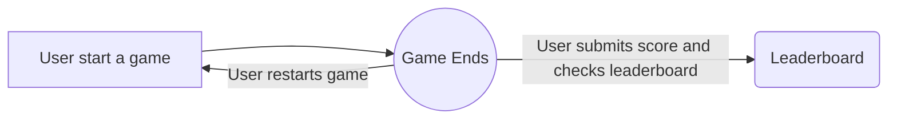

# Catcher Game (FrontEnd)

This is the frontend repository for the catcher game.
TechStack: NextJS (13), Typescript, Tailwind, Shadcn/ui
Bootstrapped with [`create-next-app`](https://github.com/vercel/next.js/tree/canary/packages/create-next-app).

## Getting Started

First, install the required packages. This repo assumes one using yarn but other major package manager (npm,pnpm) should be fine either.

Then, run the development server:

```bash

yarn  dev

# or

npm  run  dev

# or

pnpm  dev

```

Go to [http://localhost:3000](http://localhost:3000) with your browser to check if the app is running.

This app consists of these pages, which can be found in the `src/app` directory:

|              | Route          | Description                                   |
| ------------ | -------------- | --------------------------------------------- |
| Home Page    | `/`            | Homepage with game introduction               |
| Game Section | `/catchergame` | The Catcher Game                              |
| LeaderBoard  | `/leaderboard` | Showing the current ranking among all players |

The mainflow is as follow:



Without setting the environment variables, one can only play the game but cannot submit or see the scores.
The corresponding api urls, which are hosted by the backend service, need to be set in your environment variable to make the application fully functional. You may also use `.env.example` in the repo as a reference.

## UI

Components can be found in the `src/components` directory, which builds on top of [shadcn/ui](https://github.com/shadcn/ui) library.

## Missing features (To be added):

- **Mobile Support**: Although this game supports different screen size, currently it does not work on mobile devices due to difference in the native API
- **Pausing**: Currently the game starts right after one enter the page and the game cannot be paused

## Deploying

The easiest way to deploy this app is to use the [Vercel Platform](https://vercel.com/new?utm_medium=default-template&filter=next.js&utm_source=create-next-app&utm_campaign=create-next-app-readme) from the creators of Next.js.
Check out our [Next.js deployment documentation](https://nextjs.org/docs/deployment) for more details.
But of course, it can also be deployed with your preferred method.
